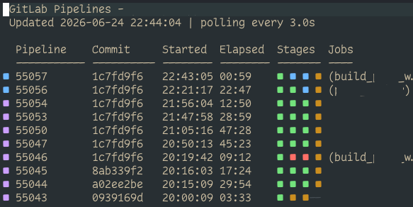

# gitlab-pipelines.nvim



Live GitLab pipeline preview for Neovim.

This plugin opens a read-only buffer that polls GitLab and renders recent pipelines as they are running.

## LazyVim

```lua
{
  "ni-kit/gitlab-pipelines.nvim",
  cmd = {
    "GitLabPipelinesOpen",
    "GitLabPipelinesClose",
    "GitLabPipelinesRefresh",
    "GitLabPipelinesStop",
  },
  opts = {
    refresh_interval = 3000,
    pipelines_limit = 10,
    show_jobs = true,
    projects = {
      ["my-project"] = {
        url = "https://gitlab.com/acme/my-project",
        token = vim.env.GITLAB_TOKEN,
        auth_type = "private-token"
      },
    },
  },
}
```

Then run:

```vim
:GitLabPipelinesOpen my-project
```

`auth_type` controls the GitLab auth header:

- `private-token` sends `PRIVATE-TOKEN: <token>` for personal, project, and group
  access tokens.
- `bearer` sends `Authorization: Bearer <token>` for OAuth tokens.

## Commands

- `:GitLabPipelinesOpen [project]` opens the preview and starts polling.
- `:GitLabPipelinesRefresh` refreshes immediately.
- `:GitLabPipelinesStop` stops polling but leaves the buffer open.
- `:GitLabPipelinesClose` closes the preview and stops polling.
